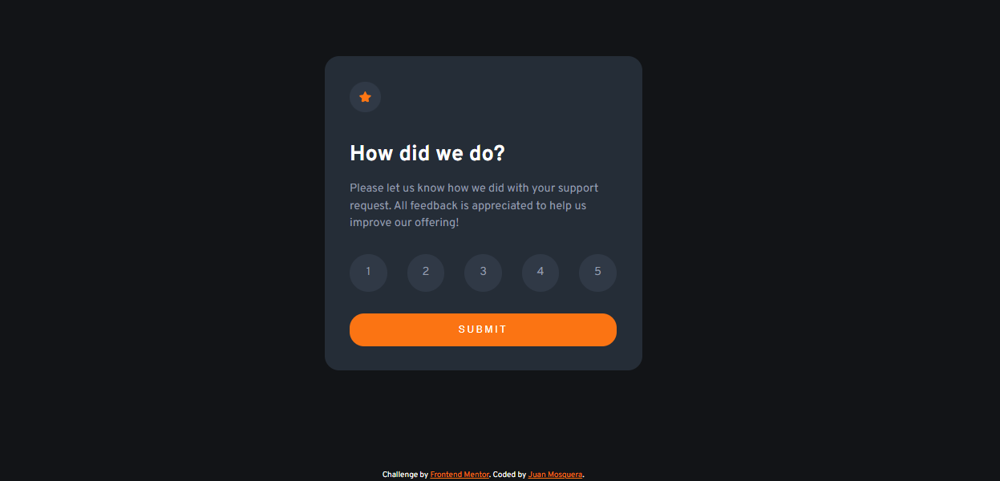
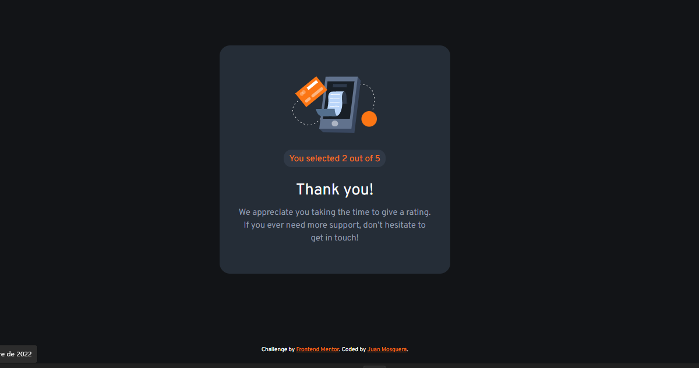

# Frontend Mentor - Interactive rating component solution

Esta es una solución para [Interactive rating component challenge on Frontend Mentor](https://www.frontendmentor.io/challenges/interactive-rating-component-koxpeBUmI). Frontend Mentor challenges help you improve your coding skills by building realistic projects. 

## Table of contents

  - [The challenge](#the-challenge)
  - [Screenshot](#screenshot)
- [My process](#my-process)
  - [Built with](#built-with)
- [Author](#author)

### The challenge

Los usuarios deben ser capaces de:

- Ver el diseño óptimo para la aplicación según el tamaño de pantalla de su dispositivo
- Ver estados de desplazamiento para todos los elementos interactivos en la página
- Seleccione y envíe una calificación numérica
- Ver el estado de la tarjeta 'Gracias' después de enviar una calificación

### Screenshot

## My process

### Built with

- Semantic HTML5 markup
- CSS custom properties
- Flex
- Mobile-first workflow
- JavaScript

## Author

- Linkedin - [Juan Mosquera](https://www.linkedin.com/in/juanmosquera98/)
- Frontend Mentor - [@yosoyteamc](https://www.frontendmentor.io/profile/Yosoyteamc)
- Instagram - [@yosoyteamc](https://www.instagram.com/yosoyteamc/)

